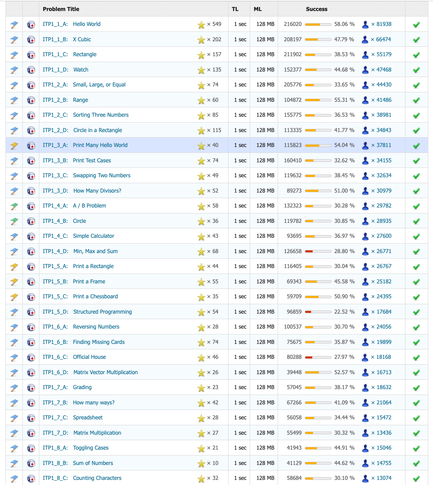

# Try Something New For 30 Days

以下の動画に感化されて、30日間今までやったことがないことや、やってみたいことにチャレンジするためのリポジトリです。

[Matt Cutts: Try Something New for 30 Days | TED Talk](https://www.ted.com/talks/matt_cutts_try_something_new_for_30_days?subtitle=en)

## 目的

このプロジェクトの目的は、新しいことに挑戦することで、自分のスキルを向上させたり、日々の生活に新しい刺激を与えたりすることです。毎日少しずつ取り組むことで、習慣化を目指します。

## やりたいことリスト

- **筋トレ**  
  毎日続けるのはシンプルに難しいが、継続することで体力を向上させる。

- **小さなウェブサイトを作る**  
  参考: [browserbook.shift-js.info](https://browserbook.shift-js.info/)  
  自分のアイデアを形にするスキルを磨く。

- **CPUの製作**  
  ハードウェアの基礎を学び、実際に動作するモデルを作成する。

- **自動オープンゴミ箱の作成**  
  日常生活を便利にするガジェットを開発する。

- **技術記事を書く**  
  学んだことや経験を共有することで、他者の役に立つコンテンツを作成する。

- **自転車通勤**  
  冬にやりたい。

- **爪を手で削らない**  
  癖で手で爪を削ってしまうことがあるため。

- **１円も使わない**　  
  小学生のような生活に戻る。

- **模型づくり**  
  建築士みたいに理想の家の模型を作ってみたい。

- **音楽を作る**  

- **絵を描く**  
  油絵を描いて家に飾りたい。
- **~~ストレッチ~~**  
  完了。

## 進捗状況

| 日付       | 活動内容                      | コメント                    |備考
|------------|------------------------------|-----------------------------|----|
| 2021/04    | 新聞を毎日読む              | めちゃめちゃ楽しかった。お金がかかる。|[instagram](https://www.instagram.com/invites/contact/?igsh=1d2jdbupeimo4&utm_content=m4rqyhd)|
| 2022/04? | ストレッチ           | 今でも毎日続いている。体は柔らかくならない |    |
| 2024/07    | 決算書を読む           | 決算書アレルギーがなくなった。  |[instagram](https://www.instagram.com/invites/contact/?igsh=1d2jdbupeimo4&utm_content=m4rqyhd)|
| 2024/08    | 競技プログラミング1日1問           | 仕事のための勉強にもなる。  |[画像](#参考) [Page](https://judge.u-aizu.ac.jp/onlinejudge/finder.jsp?course=ITP1)|

<!-- | YYYY/MM/DD | CPUの設計図を描く           | 概念が難しく時間がかかった  | -->
<!-- | YYYY/MM/DD | ゴミ箱のプロトタイプ作成      | センサーの調整が必要        | -->
<!-- | YYYY/MM/DD | 技術記事の下書き完成         | 内容をもっと具体的にする必要がある | -->

## 学びと振り返り

- **挑戦して良かったこと**  
  - 新しいスキルを獲得できた。
  - 自分の限界を知ることができた。

- **次回の改善点**  
  - 計画的に進めることで効率を上げる。
  - 途中でのモチベーション維持策を考える。

## 参考
